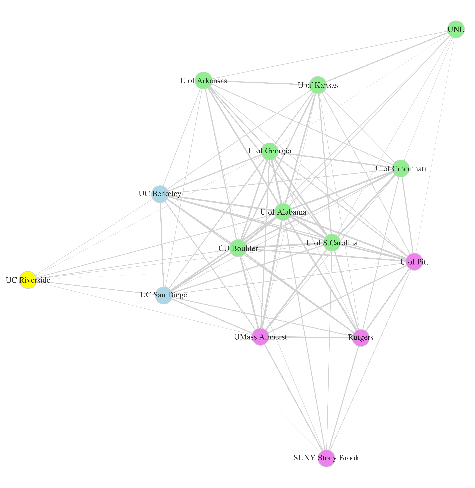

<style>
embed {
  width: 745px;
  height: 1000px;
} 

#rq2-characteristics-of-visits-to-private-high-schools embed {
  width: 690px;
  height: 735px;
}

#rq3-overlapping-networks-of-visits-to-private-high-schools embed {
  width: 750px;
  height: 590px;
}

caption {
  color: black;
  font-weight: bold;
  white-space: pre !important;
} 
</style>

```{r setup, include=FALSE}
knitr::opts_chunk$set(echo = TRUE)

library(knitr)
#library(bookdown)

library(kableExtra)
library(tidyverse)
library(gridExtra)
```

# Introduction

@RN4450 analyzed off-campus recruiting visits made in 2017 by 15 public research universities

- 12 of the 15 universities made more visits to out-of-state high schools than in-state high schools
- @RN4450 focused on visits to public high schools, finding that out-of-state visits focused on schools in affluent, predominantly white communities
- However, @RN4450 also found that public research universities made a disproportionate number of out-of-state visits to private high schools. For example
  - _University of Pittsburgh_. 170 (28%) out of 605 out-of-state high school visits were to private high schools
  - _University of California-Berkeley_. 155 (43%) out of 360 out-of-state high school visits were to private high schools
  - _University of Colorado-Boulder_. 321 (36%) out of 901 out-of-state high school visits were to private high schools

<br>

This chapter analyzes visits to private high schools by public research universities in comparison to visits to private high schools by selective private universities.

## The privatization literature

This chapter contributes to scholarship on the "privatization" of public higher education by connecting this literature to ....

<br>

@RN4543 review scholarship on privatization in higher education

- One sub-literature conceptualizes privatization as a process whereby declines in government funding cause public institutions to grow alternative revenue sources, particularly revenue from tuition and research commercialization
  - Of relevance to this chapter, public universities responded to declines in state appropriations by growing enrollment from nonresident students [@RN3753], who typically pay two- to three-times more than resident students
- Another sub-literature conceptualizes privatization as a process whereby public institutions become more similar to for-profit or private nonprofit sector organizations
  - A weakness of this literature is that few empirical studies analyze public institutions on a behavior associated with private institutions
  
<br>

The traditional mission of selective private universities vs. public research universities

- Selective private universities
  - Historically, these institutions serve the mission of social reproduction, defined as prioritizing access for affluent, college-educated households
    - (and at sectarian institutions, prioritizing access for students who share religious ideology of the institution)
  - Visits to private high schools are consistent with this social reproduction mission
- Public research universities
  - "public good" mission in access to public flagship/research universities
    - Contribute to economic and civic development by enrollinghigh achieving state residents who will be future civic, professional, and business leaders of the state
    - Contribute to *social mobility* in the state, by prioritizing the enrollment of high-achieving first-generation, low-income, and (more recently) non-white state residents
  - Visits to private high schools -- particularly out-of-state private high schools -- are antithetical to this public good access mission

<br>

Therefore, we conceptualize recruiting visits to private high schools as an ideal-type behavioral example of public flagship universities engaging in a behavior associated with the traditional social reproduction mission of selective private non-profit universities

- By analyzing visits to private high schools by public research universities and comparing them to visits made by selective private universities, we hope to develop broader insights about the privatization of public research universities

<br>

## Research questions

Analyses are motivated by three research questions


1. How does the scale of visits to private high schools by public research universities compare to the scale of visits to private high schools by private universities?
1. How do the characteristics of private high schools visited by public research universities compare to the characteristics of private high schools 
1. To what extent do public research universities and private universities visit overlapping sets of private high schools?


For each research questions we look for: similarities and differences within public research universities; similarities and differences between public and private universities


```{r cars}
summary(cars)
```

# Background and literature review

This section provides context for our analyses of off-campus recruiting visits. First, we situate off-campus recruiting within the broader set of marketing and recruiting interventions in higher education and review what market research says about off-campus recruiting. 


## Background

The "enrollment funnel" -- depicted in Figure \@ref(fig:em-funnel) -- is a conceptual heuristic that identifies stages in the student recruitment process (prospects, inquiries, applicants, accepted applicants, and enrolled students). The enrollment management industry uses the enrollment funnel to inform marketing and recruiting interventions that target specific stages.

- "Prospects" are "all the potential students you would want to attract to your institution" [@RN4322]. 
- "Inquiries" are prospects that contact the institution, including those who respond to a solicitation and those who reach out on their own. 

```{r em-funnel, echo = FALSE, fig.align = 'center', fig.cap = "The enrollment funnel", out.width = "70%"}
knitr::include_graphics('assets/images/enrollment_funnel.png')
#
```


What do we know about off-campus recruiting from market research?

- Market research describes off-campus recruiting visits as a means of identifying prospects and deepening engagement with prospects already being targeted through mail/email [@RN4323; @RN4402; @RN4664].
- @RN4402 documents the self-reported efficacy of marketing/recruiting interventions. 
  - For the median private 4-yr institution, off-campus visits were the second highest source of inquiries (after student list purchases), accounting for 17% of inquiries, and tied with student list purchases as the highest source of enrollees, accounting for 18% of enrollees. 
  - For the median public institution, off-campus visits accounted for 19% of inquiries (second only to student list purchases) and accounted for 16% of enrollees (ranked third after stealth applicants and on-campus visits).
- With respect to expenditure, Table \@ref(tab:ug-recruit-budget), reproduced from @RN4664, shows the percentage of undergraduate recruitment budget allocated to different marketing and recruiting activities


<br>

```{r ug-recruit-budget, echo=FALSE}
pct_budget <- data.frame(
  activity = c("Travel","Student search (purchased lists)","Prospective student communications","Events","Recruitment publications","Web services and digital advertising","Traditional advertising","International recruitment","Transfer recruitment","Other"),
  private = c(17,14,13,12,11,11,6,5,4,8),
  public = c(16,12,17,11,15,13,6,3,4,3)
)

#pct_budget
#str(pct_budget)
#attributes(pct_budget)
kable(
  x = pct_budget, 
  col.names = c("Activity", "Private", "Public"),
  caption = "Percentage of budget allocated to marketing/recruiting activities by private non-profit 4yr and public 4yr institutions"
) %>%
  kable_styling(bootstrap_options = c("striped", "hover", "responsive"), full_width = F, position = "left")
#  <div id="refs"></div>
```


## Literature review

We review empirical scholarship from sociology that analyzes recruiting by colleges and universities, emphasizing scholarship that analyzes off-campus recruiting and scholarship that considers private high schools.

<br>
A case study literature in sociology analyzes recruiting, often as part of a broader analysis of enrollment management or college access [e.g., @RN4324; @RN3519; @RN4538; @RN4520; @RN4407; @RN1814; @RN4647; @RN4321]. 

- @RN3519 and Khan [-@RN4321;-@RN4407] are particularly relevant to the present chapter because these studies analyze relationships between college admissions counselors and high school guidance counselors. 

<br>

@RN3519, an ethnography of the admissions office at a selective private liberal arts college, highlights the relational function of visits. 

- Stevens [-@RN3519, p. 54] states that "the College's reputation and the quality of its applicant pool are dependent upon its connections with high schools nationwide." 
- Whereas market research by @RN4402 highlights the effect of recruiting visits on inquiries and enrollees, findings from @RN3519 suggest that the College may have valued recruiting visits primarily as a means of maintaining relationships with guidance counselors. 
- The College tended to visit the same "feeder" schools year after year because recruiting depends on long-term relationships with high schools. 
- The high schools they visited tend to be affluent schools -- in particular, private schools -- that enroll high-achieving students who can afford tuition and had the resources and motivation to host a successful visit. 

<br>

@RN4321 analyzed recruiting from the perspective of an elite private boarding school in order to understand "how such schools continue to get comparatively under-qualified students into top colleges and universities" (p. 98). 

- What elite private colleges want
  - high achieving students who can pay tuition and donate
  - low acceptance rates and high yield rates
  - "interesting characters" whose curricular and extracurricular strengths meet the demands of campus constituents
- Problem faced by elite private high schools
  - some of their students are stronger than others
- Problem faced by elite private colleges  
  - Many outstanding applicants; but hard to get reliable information about which applicants will enroll if admitted
- How high school guidance counselors capitalize on this problem
  - tell colleges which high-achieving applicants are likely to accept admissions offer, which are likely to go elsewhere admissions offer and which are not
  - If a high-achieving applicant likely to go elsewhere, recommend the college consider an applicant with weaker academic credentials who would accept if admitted and brings extracurricular strengths the college values
- This horsetrading depends on
  - long-term relationship between high school and college, based on repeated interactions
  - small enough caseloads to advocate for each student

<br>

Rationale for treating off-campus recruiting visits as a relationship that can be analyzed using social network methods [from draft chapter]

> To summarize, @RN3519 finds that off-campus recruiting visits are important for the maintenance of strong relationships between a college and a high school. Strong relationships enable colleges and schools to negotiate and send trustworthy information to one another. In the absence of strong relationships, it is less likely that a college admissions counselor will "take the call" of a high school guidance counselor [@RN4321; @RN4407]. 

> Building on these ideas, we reason that the presence of a recruiting visit between a college and a high school is an indicator that the college and the high school have a relationship. First, the fact that the college made the effort to visit suggests that the college wants to enroll students from the high school. Second, the fact that the high school hosted the visit suggests that the high school likely views the college as a desirable destination for some of its students.  Third, the presence of the recruiting visit suggests the probability of additional interactions (e.g., phone calls).

# Methods

## Data collection

Our broader project collected data on off-campus recruiting visits made by a convenience sample of colleges and universities during the 2017 calendar year. 

The data collection sample comes from three different lists of postsecondary institutions: 

- all public research-extensive universities as defined by the 2000 Carnegie Classification (N=102)
- all private universities in the top 100 of U.S. News and World Report National Universities rankings (N=58)
- all private colleges in the top 50 of U.S. News and World Report Liberal Arts Colleges rankings (N=47). 

For each of these institutions, we investigated their admissions website for pages that posted their upcoming off-campus recruiting visits. 

- For institutions that posted such pages, we scraped the pages once per week throughout 2017. 
  - Many colleges and university only posted certain kinds of events (e.g., hotel receptions and national college fairs) but not others (e.g., day-time visits to high schools). These institutions are excluded from the analyses. 
- For public universities, we also collected data using public records requests  

The analysis sample for this chapter consists of:

- 15 public research universities, 
- 13 private research universities
- 12 private liberal arts colleges [may cut from analysis sample]

<br>

## Social network analysis

<br>

A social network consists of a set of actors -- referred to as "vertices" -- and the connections -- referred to as "edges" between these actors.  

- "one-mode" networks consist of vertices of the same "type" (e.g., in a publication network each vertex is an author)
- "two-mode" networks consist of vertices associated with one type of actor/entity having connections to vertices of another type. For example, an actor-movie network consists of actors (mode 1) who appear in movies (mode 2), and an actor shares an edge with a movie if the actor appears in the movie.

<br>

In our school-college two-mode network:

- the vertices are private high schools (mode 1) and colleges/universities (mode 2), 
- An edge is defined as an off-campus recruiting visits made between the two (e.g., high school $i$ shares an edge with college $j$ if high school $i$ receives at least one visit from college $j$). 
- Visits can only occur between a school-college pair (not a school-school pair or a college-college pair). 
- The resulting (weighted) network can be represented as a school-by-college matrix (e.g., a $500 \times 40$ matrix if our network contains 500 high schools and 40 colleges/universities) in which matrix cell $a_{i,j}$ identifies the number of visits that high school $i$ received from college/university $j$.

<br>

Two-mode networks are often analyzed as one-mode networks for simplicity [@RN2457]

-  we create a one-mode high school network in which two private high schools share an edge if they both receive a visit by the same college/university. Cell $s_{i,j}$ of the school-by-school matrix $S$ indicates the number of colleges/universities that visited both school $i$ and school $j$<!-- [SHOW EXCERPT OF ONE-MODE SCHOOL BY SCHOOL MATRIX, LIKE 3 BY 3 OR SOMETHING]-->. 
- Similarly, we create a one-mode college/university network (herein the college network) in which two colleges share an edge if both colleges visited the same high school. Cell $c_{i,j}$ of the college-by-college matrix $C$ indicates the number of private high schools that received at least one visit from both college $i$ and college $j$

<br>

Community detection

- Many social network analyses utilize data-driven "community detection" algorithms to categorize vertices into a small number of groups (or cluster) based purely on patterns of network ties. 
- Generally, groups are chosen to maximize the number of within-group ties while minimizing ties between members of different groups. 
- We performed hierarchical cluster analysis to allocate colleges and universities into clusters based on their private high schools visits.

# Results

## Analysis sample

## RQ1: Scale of visits to private high schools

<br>

**Number of events by type and in-state, out-of-state for public research universities institutions**

```{r event-count-figure-pubu, echo = FALSE}
# knitr::include_graphics('assets/figures/plot_event_count_pubu.pdf')

```


**Number of events by type and in-state, out-of-state for private institutions**

```{r event-count-figure-privu, echo = FALSE}
# knitr::include_graphics('assets/figures/plot_event_count_privu.pdf')

```


**Actual versus proportional visits to out-of-state private high schools for public research universities**

```{r, echo = FALSE}
# knitr::include_graphics('assets/figures/figure_5.pdf')

```

<!-- {width=1000px; height = 1000px} -->


## RQ2: Characteristics of visits to private high schools

<br>

**Characteristics of private HS visited by private institutions**

```{r ego-network-figure-privu, echo = FALSE}
# knitr::include_graphics('assets/figures/ego_network_figure_privu.pdf')

```

<br><br>

**Characteristics of private HS visited by public institutions**

```{r ego-network-figure-pubu, echo = FALSE}
# knitr::include_graphics('assets/figures/ego_network_figure_pubu.pdf')

```

## RQ3: Overlapping networks of visits to private high schools

<br>

**1-mode network for public institutions, colored by cluster** 

```{r plot-1mode-pubu, echo = FALSE}
# knitr::include_graphics('assets/figures/plot_1mode_pubu.pdf')

```

<br><br>

**1-mode network for all institutions, out-of-state visits only for public universities, colored by cluster**

```{r plot-1mode-all-pubu-outst, echo = FALSE}
# knitr::include_graphics('assets/figures/plot_1mode_all_pubu_outst.pdf')

```

# References
